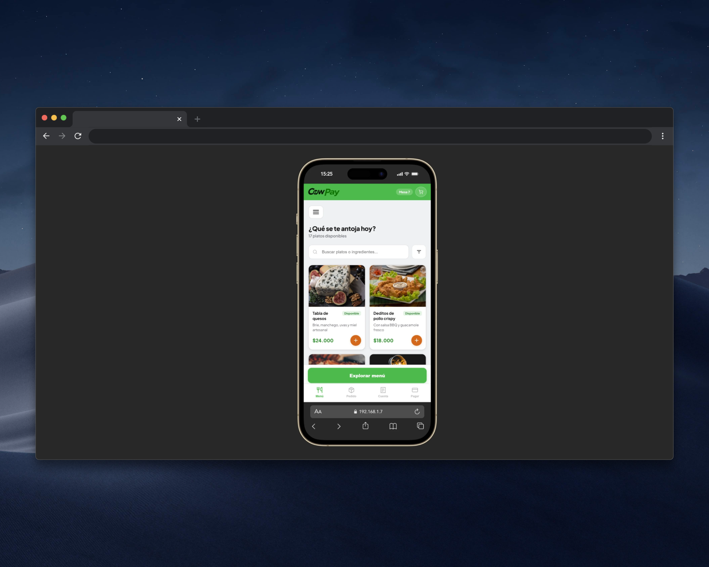

<div align="center">


### Proyecto productivo del SENA

</div>


<div align="center">


_Responsi movile_

</div>

### Estructura del proyecto

```
cowpay/ (Raíz del repositorio Git)
├── .git/
├── docs/                      ← Documentación y diseño
│   ├── UML/
│   ├── Scrum/
│   ├── prototipado/           ← Designs
│   ├── Historias de campo.docx
│   └── CowPay.pdf
├── src/                       ← Código principal
│   ├── index.html
│   ├── css/
│   └── img/
├── README.md
└── .gitignore
```

## Servidor

Para iniciar el servidor local:
```bash
npx serve -p 3000 src
```

Para iniciar un servidor público-temporal:
```bash
ssh -R 80:localhost:3000 nokey@localhost.run
ó
npx serve -l tcp://0.0.0.0:3000 src
```